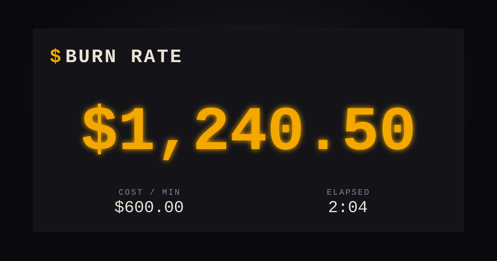

# Burn Rate

**▶ Live demo · [apps.charliekrug.com/burn-rate](https://apps.charliekrug.com/burn-rate/)**

Watch your meeting's cost climb live. Enter the headcount and the average salary in the room,
hit start, and screen-share the link. Everyone watches a dollar figure tick up several times a
second for as long as the meeting runs.

[](https://github.com/ctkrug/burn-rate/actions/workflows/ci.yml)
[](LICENSE)



## Why

Every meeting cost calculator does the same thing: you fill in a form and get a static total
*after* the meeting ends. A number you read in a spreadsheet on Friday does not change how a
meeting runs on Tuesday. Burn Rate is built to be watched *during* the meeting, projected on a
screen while the figure climbs in front of the room. A final total never made anyone flinch. A
live, rising number does.

## Features

- **Live ticker.** A dollar figure that visibly increases multiple times per second once
  started, driven by headcount times average salary over a standard 2,080-hour work year.
- **Shareable link.** Every setting (headcount, salary, start time) lives in the URL, so pasting
  the link into a screen-share or chat resumes the same already-ticking counter from the same
  start time. A **Copy Link** button puts it on the clipboard.
- **Presenter mode.** A stripped-down view with nothing but the giant counter, made to fill a
  shared screen. It rides in the URL so it survives a reload, and exits on Escape.
- **Pause, resume, reset.** All measured against elapsed time, so resume continues from where
  you paused rather than restarting at zero.
- **Milestone feedback.** The counter flashes red and a synthesized cue fires each time the
  total crosses a $1,000 threshold, with a mute toggle that persists across reloads.
- **Quick-fill presets and recall.** One-click meeting shapes (standup, team sync, all-hands),
  and the last values you entered are restored on your next visit.
- **Tab-title readout.** The running total is mirrored into the browser tab title, so a
  backgrounded instrument still reads at a glance.
- **No backend.** No server, no database, no accounts. State lives in the URL and browser
  timers, so the whole thing is a static page that runs the instant a link opens.

## How the cost is calculated

The math is plain on purpose, so it holds up if someone in the room asks about it. Each salary
is converted to a per-second rate over a standard 2,080-hour work year (40 hours a week, 52
weeks), then multiplied by the headcount. No invented multipliers, no "meeting tax". Ten people
earning an average of $120,000 a year burn about **$9.62 a minute**, or roughly $577 an hour.

## Run it locally

```sh
npm install
npm start        # serves site/ at http://localhost:8080
npm test         # runs the unit tests (node:test)
npm run lint     # ESLint
```

There is no build step. The files in `site/` are the app, served as-is.

## Project structure

```
site/       static app: index.html, style.css, app.js, and pure modules
            (calc, ticker, milestone, audio, inputs, state)
tests/      node:test unit tests for every module plus three headless app suites
scripts/    local dev tooling (static file server)
docs/       vision, design direction, architecture, backlog, launch kit
```

See [`docs/VISION.md`](docs/VISION.md) for the product thinking,
[`docs/DESIGN.md`](docs/DESIGN.md) for the retro-LED visual direction, and
[`docs/ARCHITECTURE.md`](docs/ARCHITECTURE.md) for the module map.

## License

MIT. See [`LICENSE`](LICENSE).

---

More of Charlie's projects → [apps.charliekrug.com](https://apps.charliekrug.com)
